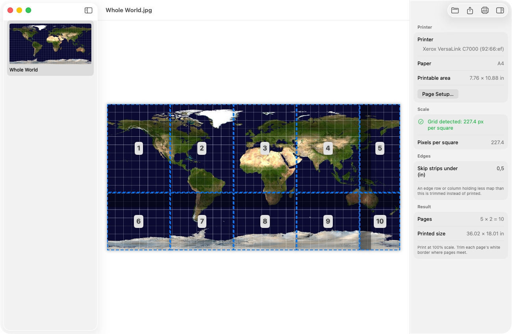

# Mapsmith

[](https://github.com/scooper4711/mapsmith/actions/workflows/ci.yml)
[](https://sonarcloud.io/summary/new_code?id=scooper4711_mapsmith)
[](https://sonarcloud.io/summary/new_code?id=scooper4711_mapsmith)
[](https://github.com/scooper4711/mapsmith/releases)
[](https://github.com/scooper4711/mapsmith/releases)
[](#requirements)
[](./LICENSE)

A Mac app that prints battle maps at true scale, one grid square per inch, on ordinary printer paper.

A Flip-Mat PDF or a map from an adventure is far bigger than a sheet of paper, and printing it "to fit" shrinks
the squares until miniatures no longer fit them. Mapsmith finds the map's grid, splits the map into pages
that fit your printer's printable area at exactly one inch per square, and prints them, ready to trim and
tape together.

It is free, and it works with any PDF or image you open; it contains no maps of its own.



*A world map with a 10° grid, split into ten A4 pages at one inch per square. The map is public
domain (see [Sample map](#sample-map)).*

## Features

- **Open** a PDF or any image (⌘O, drag it onto the window, or *Open With* in Finder). For a PDF, every
  large image in the document is shown as a thumbnail. Each file opens in its own window, and
  **File › Open Recent** lists the latest ones. Images dragged straight out of another app, such as a map
  from [Pluck](https://github.com/scooper4711/pluck), can be dropped too.
- **Select** a map: its grid is detected and it is split into pages that fit the printable area of the
  current printer and paper (**File › Page Setup…**). Edge strips thinner than 0.5 in are trimmed rather
  than printed on their own pages, and the map is turned 90° when that uses fewer pages.
- **Print** the pages directly (⌘P), or **Export** them as a PDF (⌘E).

Print at 100% scale. Each page keeps the printer's non-printable margin blank; trim that border where pages
meet.

### How the scale is found

Grid detection sums edge strength along every row and column of the map and finds the repeat distance by
autocorrelation. If no grid is found, the app falls back to the PDF's own page scale or the image's DPI
metadata, and you can always type the pixels per grid square yourself in the inspector.

## Requirements

macOS 15 or later.

## Installing a release

Download the disk image from the [releases page](https://github.com/scooper4711/mapsmith/releases), open it
and drag Mapsmith to Applications.

The app is not notarized by Apple, so macOS blocks it the first time:

1. Open Mapsmith once. macOS says it cannot be opened; click Done.
2. Open System Settings › Privacy & Security and scroll down to the message about Mapsmith.
3. Click Open Anyway and confirm.

After that it opens normally.

## Society Toolkit

Mapsmith is part of the Society Toolkit, free Mac apps for Pathfinder and Starfinder players and GMs. Like
the toolkits in the game, each one grants a +1 item bonus to game prep.

- [Scrollkeeper](https://github.com/scooper4711/scrollkeeper) keeps your Paizo library in order and
  downloads your purchases.
- [Pluck](https://github.com/scooper4711/pluck) gets the art, text and stat blocks out of a PDF.
- [Pawn Shop](https://github.com/scooper4711/pawn-shop) prints just the pawns you need, single-sided, from
  your pawn PDFs.
- **Mapsmith** prints battle maps at true scale on ordinary paper.

## Supporting the project

The app is free and always will be. If it saves you time and you would like to say thanks, you can leave a
tip on [Ko-fi](https://ko-fi.com/coop207627). A donation is entirely optional and unlocks nothing.

## Building

```sh
make app      # builds "build/Mapsmith.app"
make run      # builds and launches the app
make install  # builds the app and moves it to /Applications
make test     # runs the unit tests
make lint     # runs SwiftLint
make coverage # runs the tests and enforces the coverage threshold
make dmg      # packages the app into a disk image
make icon     # redraws Resources/AppIcon.icns
```

Building needs Xcode 16 or later (Swift 6 toolchain). The app is ad-hoc signed. Open `Package.swift` in Xcode
to run and debug it.

Tests that read real maps use PDFs in `TestData/`, which is not committed because the maps are copyrighted.
Copy or link your own Flip-Mat PDFs there to run them; they are skipped when the folder is empty.

The code is in two parts: `Sources/MapsmithCore` holds all the logic and is unit tested (grid detection,
finding maps in PDFs, planning and exporting pages), and `Sources/Mapsmith` is the SwiftUI app.

## Where things are stored

| What | Where |
|---|---|
| Images dropped from other apps | `~/Library/Caches/com.github.scooper4711.Mapsmith/Dropped Maps/` |
| Exported pages | wherever you save them, as PDF files |

## Documentation

The requirements and design are in [`docs/specs`](docs/specs).

## Regarding the use of AI

I used AI as a coding assistant while building this. I'm a software engineer with decades of professional
experience. I could have written every line myself, but AI let me move faster. I drove the architecture and
design decisions, followed industry best practices for code quality, and made sure everything is
human-readable and maintainable. The project has SonarCloud quality gates and a full test suite that must pass
before any release.

Think of it like driving a car instead of walking. I plan the route, decide the stops along the way, and AI
gets me to the destination faster than I could on foot. But I'm still the one behind the wheel.

If you don't want to use tools written with AI assistance, then I respect that decision. That's why I'm
transparent about it. You can make up your own mind.

## Sample map

The map in the screenshot is NASA Earth Observatory's
[Whole world – land and oceans](https://commons.wikimedia.org/wiki/File:Whole_world_-_land_and_oceans.jpg)
(public domain), with a 10° latitude and longitude grid drawn over it so each cell is square.

## License

Mapsmith is released under the [MIT license](LICENSE). It uses no third-party libraries.

## Trademarks

Pathfinder, Starfinder, Flip-Mat and Paizo are trademarks of Paizo Inc. Mapsmith is an independent fan
project. It is not published, endorsed, or specifically approved by Paizo, and it contains no Paizo content.
